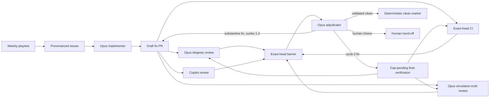

# Agentic playtest repair loop

The weekly playtester still stops at issues. A second workflow picks up only the
issues carrying that run's hidden gh-aw provenance marker, checks them against
the current game, and opens one draft PR per coherent root cause. It may open
three PRs in a run, but it may not alter the control plane or merge its work.
The implementer can also be dispatched directly with a provenance run ID and an
optional comma-separated issue scope; that retry path does not rerun the
playtester or create more findings.



## What counts as all reviews being in

The join is ordinary Actions code, not an agent judgement. Diegesis and
simulation-truth reviews must each include their receipt and the full current
head SHA. Copilot's review must also belong to that SHA, and CI must have
completed on it. A failed CI run still dispatches the adjudicator so it can be
diagnosed and fixed; it can never produce a clean marker. Old reviews do not
carry over after a push, and a forged specialist receipt is ignored unless it
was submitted by the repository workflow actor.

Copilot cycles are counted by unique reviewed head SHAs. Duplicate reviews on
one commit still count as one cycle. After a third Copilot-reviewed head, the
adjudicator may make one final fix but must not ask for a fourth Copilot review.
That pushed head enters a non-terminal `cap-pending` state: CI and both Opus
reviewers run again, then one final adjudication either records a validated
clean result or hands a remaining change to a human.

Terminal state is a safe-output operation backed by deterministic checks. It
verifies the current SHA, green CI, required review receipts and zero unresolved
threads before writing the exact clean marker. The model supplies the decision
ledger, but does not format or authorise its own terminal state.

A validated clean result also rings the doorbell: the deterministic finalize
step flips the draft to ready-for-review and assigns the repository owner. That
is the only path from draft to ready, so a ready PR always means the loop
finished clean and it is a human's turn. Draft means the machine is still
working; `needs-human` means it stopped and named a decision.

The watchdog checks every ten minutes. After twenty minutes it names missing
reviewers or pending CI on the PR; silence never becomes a pass. It recovers a
completed join if the immediate barrier missed its dispatch and retries stale
dispatch locks when an adjudicator run or its safe outputs failed.

Copilot drops review requests made by `github-actions[bot]` without a trace, so
the watchdog also re-requests Copilot with the CI trigger token, at most once
per head, and reports the attempt (or its failure) as a marker comment on the
PR. If a review round is still waiting on anything six hours after the waiting
notice first appeared, the watchdog posts the `needs-human` terminal marker and
pauses the loop for that PR; deleting that comment resumes it.

## Agent authority

All automated PRs must target `main`, carry the `playtest` label, use the
`[agentic playtest] ` title prefix, and come from this repository. Code-writing
outputs are restricted to game source, tests, tools and project docs. Agent
instructions, workflows, dependency files and other protected files are
blocked. Reviewers can only leave non-blocking `COMMENT` reviews. Nothing in the
loop can approve or merge a PR.

The adjudicator replies to each handled thread as `Addressed`, `Overridden`,
`Already covered` or `Outdated`, then resolves it. `Needs human` stops the loop
when the feedback exposes a real product choice. Copilot advice can be
overridden when it is wrong, disproportionate, out of scope, bad for arka's
voice, or crosses the deterministic simulation boundary.

## Token setup

The workflow deliberately separates inference from repository mutation:

- `COPILOT_GITHUB_TOKEN` is the inference credential. Its fine-grained PAT only
  needs account permission `Copilot Requests: Read`.
- `GH_AW_CI_TRIGGER_TOKEN` is the event credential. Scope it only to this
  repository with `Contents: Read and write` (branch pushes) and
  `Pull requests: Read and write` (PR creation and Copilot review requests).
- GitHub's short-lived per-run `GITHUB_TOKEN` replies, resolves threads and
  writes terminal markers under the permissions compiled for each safe-output
  job, keeping the adjudicator's thread-by-thread voice visibly the bot's.

The writes that must generate events use the event credential, not
`GITHUB_TOKEN`: the implementer's branch push and PR creation, the
adjudicator's push, and every Copilot review request. This is deliberate, and
it is what keeps the loop human-free in the middle. Bot-authored PRs sit
behind the contributor-approval gate on every single run, events created by
`GITHUB_TOKEN` launch no workflows at all, and Copilot silently ignores
review requests from `github-actions[bot]` because the bot holds no Copilot
seat. A PR authored by the event credential's owner has none of those
problems: CI, both Opus reviewers and Copilot all start unprompted on every
head. The trade-off is provenance: loop PRs are authored by the token owner,
and the `[agentic playtest] ` prefix plus `playtest` label carry the "a
machine wrote this" signal instead of the author field.

The watchdog re-requests Copilot with the same credential, at most once per
head, when a requested review never arrives, and reports the attempt as a
marker comment. The implementer and adjudicator both fail fast in a pre-step
when the secret is missing, so a lapsed token is a red X rather than a silent
stall. The Opus reviewer triggers still allow `github-actions[bot]` as a
fallback actor for any remaining bot-driven events.

## Editing the loop

Edit the `.md` agentic workflows, not their generated `.lock.yml` files. Compile
with the current gh-aw release:

```bash
gh aw compile --approve --validate
node --test tests/test_agentic_review_state.cjs
```

The specialist skills live under `.agents/skills/`. `.agents` is the portable
project convention; Copilot also recognises it, behind its GitHub-specific
`.github/skills` location in lookup priority.
