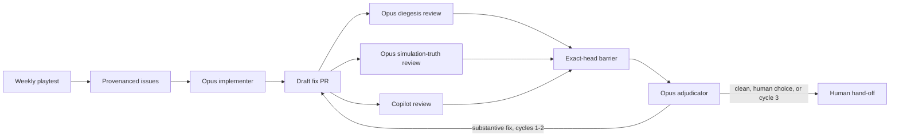

# Agentic playtest repair loop

The weekly playtester still stops at issues. A second workflow picks up only the
issues carrying that run's hidden gh-aw provenance marker, checks them against
the current game, and opens one draft PR per coherent root cause. It may open
three PRs in a run, but it may not alter the control plane or merge its work.



## What counts as all reviews being in

The join is ordinary Actions code, not an agent judgement. Diegesis and
simulation-truth reviews must each include their receipt and the full current
head SHA. Copilot's review must also belong to that SHA. Old reviews do not
carry over after a push, and a forged specialist receipt is ignored unless it
was submitted by the repository workflow actor.

Copilot cycles are counted by unique reviewed head SHAs. Duplicate reviews on
one commit still count as one cycle. After a third Copilot-reviewed head, the
adjudicator may make one final fix but must stop without asking for a fourth
review. The PR comment says plainly when that leaves the final head unreviewed.

The watchdog checks every ten minutes. After twenty minutes it names missing
reviewers on the PR; silence never becomes a pass. It also recovers a completed
join if the immediate barrier missed its dispatch.

## Agent authority

All automated PRs must target `main`, carry the `playtest` label, use the
`[agentic playtest] ` title prefix, and come from this repository. Code-writing
outputs are restricted to game source, tests, tools and project docs. Agent
instructions, workflows, dependency files and other protected files are
blocked. Reviewers can only leave non-blocking `COMMENT` reviews. Nothing in the
loop can approve or merge a PR.

The adjudicator replies to each handled thread as `Addressed`, `Overridden`,
`Already covered` or `Outdated`, then resolves it. `Needs human` stops the loop
when the feedback exposes a real product choice. Copilot advice can be
overridden when it is wrong, disproportionate, out of scope, bad for arka's
voice, or crosses the deterministic simulation boundary.

## Token setup

The existing `COPILOT_GITHUB_TOKEN` fine-grained PAT is reused. Give it access
only to this repository, with:

- account permission `Copilot Requests: Read`;
- repository permission `Contents: Read and write`;
- repository permission `Pull requests: Read and write`.

The account permission pays for Copilot inference. Contents write lets gh-aw
push the extra empty commit that wakes normal CI and PR events after an agent
push. Pull requests write lets the adjudicator resolve bot-authored review
threads reliably. Issue and PR creation, comments, review submission and the
join dispatch continue to use GitHub's short-lived workflow token.

## Editing the loop

Edit the `.md` agentic workflows, not their generated `.lock.yml` files. Compile
with the current gh-aw release:

```bash
gh aw compile --approve --validate
node --test tests/test_agentic_review_state.cjs
```

The specialist skills live under `.agents/skills/`. `.agents` is the portable
project convention; Copilot also recognises it, behind its GitHub-specific
`.github/skills` location in lookup priority.
