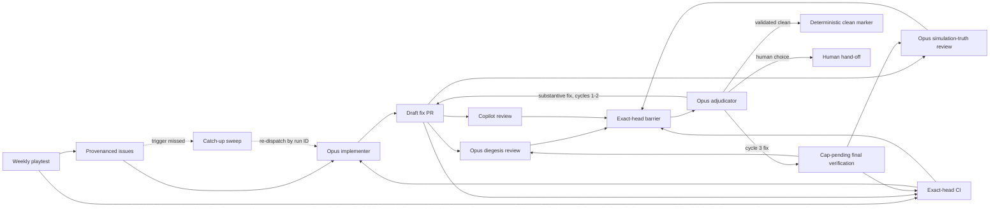

# Agentic playtest repair loop

The weekly playtester still stops at issues. A second workflow picks up only the
issues carrying that run's hidden gh-aw provenance marker, checks them against
the current game, and opens one draft PR per coherent root cause. It may open
three PRs in a run, but it may not alter the control plane or merge its work.
The implementer can also be dispatched directly with a provenance run ID and an
optional comma-separated issue scope; that retry path does not rerun the
playtester or create more findings.


```mermaid
flowchart LR
  P["Weekly playtest"] --> I["Provenanced issues"]
  P --> T["Deterministic trigger"]
  I --> F["Opus implementer"]
  T --> F
  I -.->|"trigger missed"| K["Catch-up sweep"]
  K -.->|"re-dispatch by run ID"| F
  F --> PR["Draft fix PR"]
  PR --> D["Opus diegesis review"]
  PR --> S["Opus simulation-truth review"]
  PR --> C["Copilot review"]
  D --> B["Exact-head barrier"]
  S --> B
  C --> B
  PR --> T["Exact-head CI"]
  T --> B
  B --> A["Opus adjudicator"]
  A -->|"substantive fix, cycles 1-2"| PR
  A -->|"cycle 3 fix"| V["Cap-pending final verification"]
  V --> T
  V --> D
  V --> S
  A -->|"validated clean"| X["Deterministic clean marker"]
  A -->|"human choice"| H["Human hand-off"]
```

## What counts as all reviews being in

The join is ordinary Actions code, not an agent judgement. Diegesis and
simulation-truth reviews must each include their receipt and the full current
head SHA. Copilot's review must also belong to that SHA, and CI must have
completed on it. A failed CI run still dispatches the adjudicator so it can be
diagnosed and fixed; it can never produce a clean marker. Old reviews do not
carry over after a push, and a forged specialist receipt is ignored unless it
was submitted by the repository workflow actor.

Copilot cycles are counted by unique reviewed head SHAs. Duplicate reviews on
one commit still count as one cycle. After a third Copilot-reviewed head, the
adjudicator may make one final fix but must not ask for a fourth Copilot review.
That pushed head enters a non-terminal `cap-pending` state: CI and both Opus
reviewers run again, then one final adjudication either records a validated
clean result or hands a remaining change to a human.

Terminal state is a safe-output operation backed by deterministic checks. It
verifies the current SHA, green CI, required review receipts and zero unresolved
threads before writing the exact clean marker. The model supplies the decision
ledger, but does not format or authorise its own terminal state.

A validated clean result also rings the doorbell: the deterministic finalize
step assigns the repository owner and applies the `validated-clean` label. The
PR stays a draft. Nothing in the loop needs the ready state; CI, both Opus
reviewers and Copilot all run on draft PRs, so marking ready is a purely human
act done at merge time. A `needs-human` stop applies its own label, so both
terminal states are visible straight from the PR list: an assigned,
`validated-clean` draft is finished and waiting for a human, a `needs-human`
draft stopped and named a decision, and an unlabelled draft means the machine
is still working.

The watchdog checks every ten minutes. After twenty minutes it names missing
reviewers or pending CI on the PR; silence never becomes a pass. It recovers a
completed join if the immediate barrier missed its dispatch and retries stale
dispatch locks when an adjudicator run or its safe outputs failed.

Copilot drops review requests made by `github-actions[bot]` without a trace, so
the watchdog also re-requests Copilot with the CI trigger token, at most once
per head, and reports the attempt (or its failure) as a marker comment on the
PR. If a review round is still waiting on anything six hours after the waiting
notice first appeared, the watchdog posts the `needs-human` terminal marker,
applies the matching label and pauses the loop for that PR; deleting that
comment resumes it, and the watchdog clears the label on its next pass.

## When the implementer never wakes

The `workflow_run` trigger fires once and is never retried. Two things make it
miss: the implementer run dies before it selects anything, or the playtest
review ran on a branch other than `main`, which the trigger refuses. Either way
the issues sit open with nothing watching them. Both happened on 29 July 2026:
a failed implementer run orphaned #113 and #114, and a review run on
`fictional-disco` orphaned #111.

`playtest-implementer-trigger.yml` owns the privileged `workflow_run` event and
dispatches the agentic implementer with the completed review's exact run ID.
Keeping that event out of the compiled workflow matters: gh-aw adds a caller
membership gate to mixed `workflow_run`/`workflow_dispatch` workflows, and an
internal dispatch made with `GITHUB_TOKEN` arrives as `github-actions[bot]`.
That bot has no repository membership, so the target used to stop before agent
activation while the outer run still looked successful.

`playtest-implementer-catchup.yml` sweeps every thirty minutes to close the
remaining gap. It is ordinary Actions code with no model, and the only thing it
can do is re-dispatch the implementer against a provenance run ID it has already
checked.
Before dispatching, that ID must resolve to a real, completed, successful run of
the weekly playtest review whose exact head is already trusted by the default
branch. The sweep reads the run ID only from gh-aw's own footer comment, so a
marker typed into issue prose buys nothing, and an issue carrying two different
provenance runs is skipped rather than guessed at.

It does not widen what the implementer may act on. It passes a run ID and the
subset of that run's issues no fix PR already closes, and the implementer still
re-verifies the label and the exact provenance marker on every issue it selects.

Rate limits keep it boring: one dispatch per sweep, nothing dispatched while an
implementer run is already going, nothing dispatched for a run whose issues are
less than thirty minutes old (that window belongs to the ordinary trigger), and
two attempts per run ID with a two hour cooldown between them. Attempts are
counted from `<!-- playtest-catchup-v2-dispatch:<run>:<n> -->` marker comments
written on every open issue of that run, so the ledger survives one of those
issues being closed by a merged fix. After the second attempt the sweep stops
and applies `needs-human` rather than retrying forever.

A review run on a branch other than `main` is not dispatched while that head is
still branch-only. That run used its own copy of the reviewer instructions, and
auto-dispatching it would quietly hand unmerged workflow code the same authority
as `main`. The sweep says so once and applies `needs-human`. On later passes it
compares the review head with `main`: once that exact commit is contained in the
default branch, the finding has acquired main's authority and can be retried
normally. Squashed, divergent or still-unmerged heads remain human decisions.

The retry ledger uses `playtest-catchup-v2-*` markers. The original unversioned
ledger was retired after it counted two implementer dispatches which gh-aw had
rejected before activation; preserving those comments keeps the incident
visible, while ignoring them prevents false attempts from permanently spending
the repaired workflow's retry budget.

## Manual dispatch scope

Runtime-imported prompt bodies get their `${{ }}` expressions resolved by
gh-aw's own evaluator, not by Actions, and that evaluator implements `||` and
plain property lookups only. It does not evaluate `&&` or comparisons. An
expression like `github.event_name == 'x' && a || b` therefore skips straight to
`b`, silently, on a clean compile.

That is what broke the manual retry path. The prompt asked for
`github.event_name == 'workflow_dispatch' && github.event.inputs.playtest_run_id
|| github.event.workflow_run.id`, so a `workflow_dispatch` run fell through to
`github.event.workflow_run.id`, which does not exist on that event. The agent
received a literal unresolved expression, substituted the only run ID it could
see, its own, matched no issues and exited green with a `noop`. Run
30483810310 did exactly that while `playtest_run_id: 30435646548` sat correctly
in the step env the whole time.

The prompt no longer interpolates either value. A deterministic pre-agent step
reads `github.event.inputs.playtest_run_id`, requires plain digits, resolves the
matching issue set, and writes both values to files under `$RUNNER_TEMP` for the
agent to read. The ordinary trigger, catch-up sweep and manual dispatch all use
that same path. A missing or malformed run ID fails before the model starts;
there is no fallback to the implementer's own run ID.

## Agent authority

All automated PRs must target `main`, carry the `playtest` label, use the
`[agentic playtest] ` title prefix, and come from this repository. Code-writing
outputs are restricted to game source, tests, tools and project docs. Agent
instructions, workflows, dependency files and other protected files are
blocked. Reviewers can only leave non-blocking `COMMENT` reviews. Nothing in the
loop can approve or merge a PR.

The adjudicator replies to each handled thread as `Addressed`, `Overridden`,
`Already covered` or `Outdated`, then resolves it. `Needs human` stops the loop
when the feedback exposes a real product choice. Copilot advice can be
overridden when it is wrong, disproportionate, out of scope, bad for arka's
voice, or crosses the deterministic simulation boundary.

## Token setup

The workflow deliberately separates inference from repository mutation:

- `COPILOT_GITHUB_TOKEN` is the inference credential. Its fine-grained PAT only
  needs account permission `Copilot Requests: Read`.
- `GH_AW_CI_TRIGGER_TOKEN` is the event credential. Scope it only to this
  repository with `Contents: Read and write` (branch pushes) and
  `Pull requests: Read and write` (PR creation and Copilot review requests).
- GitHub's short-lived per-run `GITHUB_TOKEN` replies, resolves threads and
  writes terminal markers under the permissions compiled for each safe-output
  job, keeping the adjudicator's thread-by-thread voice visibly the bot's.

The writes that must generate events use the event credential, not
`GITHUB_TOKEN`: the implementer's branch push and PR creation, the
adjudicator's push, and every Copilot review request. This is deliberate, and
it is what keeps the loop human-free in the middle. Bot-authored PRs sit
behind the contributor-approval gate on every single run, events created by
`GITHUB_TOKEN` launch no workflows at all, and Copilot silently ignores
review requests from `github-actions[bot]` because the bot holds no Copilot
seat. A PR authored by the event credential's owner has none of those
problems: CI, both Opus reviewers and Copilot all start unprompted on every
head. The trade-off is provenance: loop PRs are authored by the token owner,
and the `[agentic playtest] ` prefix plus `playtest` label carry the "a
machine wrote this" signal instead of the author field.

Neither credential can flip a draft PR to ready-for-review: GitHub's
draft/ready GraphQL mutations reject scoped tokens, `GITHUB_TOKEN` and
fine-grained PATs alike, with "Resource not accessible by integration". That
is why the loop hands over a draft and signals completion with assignment and
labels instead; marking ready stays a human act.

The watchdog re-requests Copilot with the same credential, at most once per
head, when a requested review never arrives, and reports the attempt as a
marker comment. The implementer and adjudicator both fail fast in a pre-step
when the secret is missing, so a lapsed token is a red X rather than a silent
stall. The Opus reviewer triggers still allow `github-actions[bot]` as a
fallback actor for any remaining bot-driven events.

## Editing the loop

Edit the `.md` agentic workflows, not their generated `.lock.yml` files. Compile
with the gh-aw release the locks are already pinned to, currently v0.83.1, and
pass `--no-check-update` so the extension does not silently upgrade itself
mid-compile and drag an unrelated toolchain bump into the diff:

```bash
gh extension install github/gh-aw --pin v0.83.1 && \
  gh aw compile <workflow> --no-check-update
node --test tests/test_agentic_review_state.cjs
```

`gh` re-upgrades the extension between shell invocations, which is why the pin
and the compile are chained above. Check `.github/aw/actions-lock.json` is
untouched afterwards; if it moved, the compile ran on the wrong version. Bumping
gh-aw is fine, but do it as its own change so the toolchain diff is readable.

The specialist skills live under `.agents/skills/`. `.agents` is the portable
project convention; Copilot also recognises it, behind its GitHub-specific
`.github/skills` location in lookup priority.

## Model compatibility

The implementer, adjudicator and both specialist reviewers pin a literal model
name. That name is validated twice: once by the compiler, and again at runtime
by AWF's own `SUPPORTED_COPILOT_MODELS` allow-list. The two lists drift apart on
every release ([github/gh-aw#48583](https://github.com/github/gh-aw/issues/48583)),
so a model can compile clean and still abort every run. The weekly reviewer is
deliberately unpinned and follows the gh-aw default.

That is what happened to `claude-opus-5`. It was pinned on 25 July 2026 and
never once reached the model. The agent job dies in AWF preflight with:

```
Error: model 'claude-opus-5' is unsupported or unrecognized by this AWF version.
Did you mean 'claude-opus-4.8'?
```

Reproduced on AWF v0.27.38 (gh-aw v0.83.1) and v0.27.42 (v0.83.4, latest at the
time), so upgrading would not have fixed it. `gh aw compile` reported zero
errors and zero warnings, and happily resolved Opus 5 pricing into the lock. The
Copilot backend advertises `claude-opus-5` in the api-proxy model inventory; it
is AWF's allow-list that is behind.

The pins now sit on `claude-opus-4.8`, verified green on this repo's toolchain.

### Getting back to Opus 5

`claude-opus-5` is the correct spelling, so no naming variant will help. The
validator normalises `.` and `_` to `-` before matching
([`src/copilot-model.ts`](https://github.com/github/gh-aw-firewall/blob/main/src/copilot-model.ts)),
which means `claude-opus-5.0` becomes `claude-opus-5-0` and misses too. Only the
exact string is accepted, and it is already in `SUPPORTED_COPILOT_MODELS` on
firewall `main`, added 28 July 2026 by
[gh-aw-firewall#6695](https://github.com/github/gh-aw-firewall/pull/6695).

This is a release-lag problem, not a configuration one. The fix is merged but
unshipped: the newest firewall release is v0.27.42 (26 July), two days before
the commit, and gh-aw v0.83.5 still pins firewall 0.27.41. Nothing to do at this
end until a firewall release carries the fix and a gh-aw release pins it. Check
with:

```bash
gh api repos/github/gh-aw-firewall/contents/src/copilot-model.ts \
  --jq '.content' | base64 -d | grep -c "claude-opus-5"   # on the newest tag
gh api repos/github/gh-aw/contents/pkg/actionpins/data/action_pins.json \
  --jq '.content' | base64 -d | grep -o "gh-aw-firewall/agent:[0-9.]*"
```

When both line up, bump gh-aw, smoke-test, then move the pins.

Before changing any pin, smoke-test it. Compiling is not evidence:

1. Branch, add a throwaway workflow with the new `model:` and an
   `on: push: branches: [<your-branch>]` trigger and a one-line prompt.
2. Compile, push, and wait for the run.
3. Require the `agent` job green, and confirm the model in the run's
   `aw_info.json` (`gh run download <id>`) matches what you pinned.
4. Delete the branch, then move the real pins.
